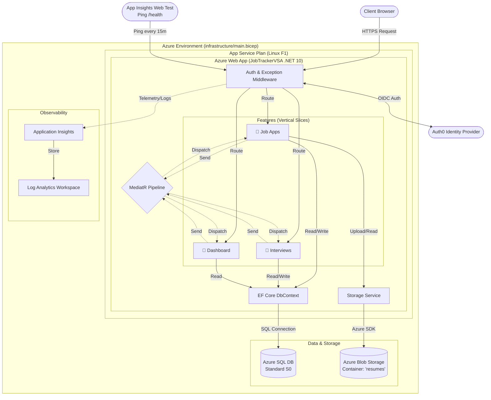
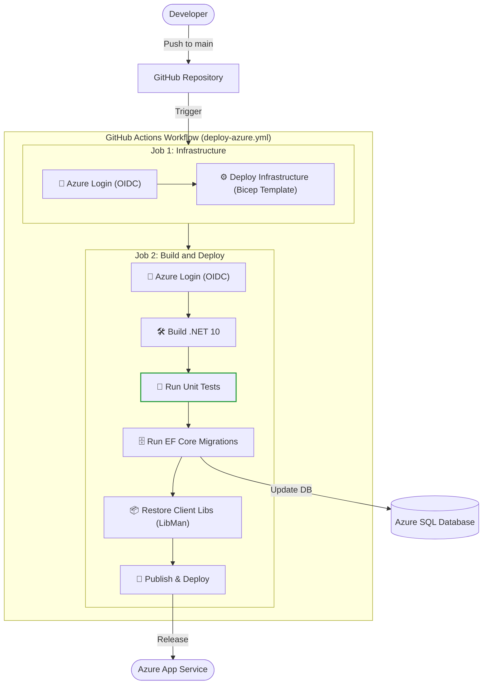

# JobTrackerVSA

A modern Vertical Slice Architecture Web App for tracking job applications and interviews, built with ASP.NET Core 10 and SQL Server.

## 🟢 Live Demo
**Try the app here:** [https://jobtracker-raul.azurewebsites.net/](https://jobtracker-raul.azurewebsites.net/)


## Architecture
- **Vertical Slice Architecture:** Logic organized by Features (`Features/JobApplications/Add`, etc.).
- **CQRS:** Using MediatR for clean separation of commands and queries.
- **Unit Testing:** Comprehensive test suite for all features using xUnit and EF Core In-Memory(DB).
- **Observability:** Centralized exception logging via MediatR Pipeline Behavior.
- **Security:** "Secure by Default" policy. All endpoints require authentication unless marked `[AllowAnonymous]`.
- **Cloud Storage:** Secure document storage (Resumes/CVs) integration using Azure Blob Storage with strict server-side validation (Magic Numbers checking) and private-by-default access policies.

### Architecture Diagram



## API Documentation
For detailed API information, interactive testing, and schema definitions, visit our **OpenAPI Documentation** powered by [Scalar](https://github.com/scalar/scalar) (a modern alternative to Swagger UI).

👉 **[View API Docs](https://jobtracker-raul.azurewebsites.net/scalar)**

## 🚀 Deployment & DevOps
This project implements a professional, fully automated **CI/CD pipeline** targeting **Microsoft Azure**.

### Infrastructure as Code (IaC)
- **Azure Bicep:** The entire infrastructure (Linux App Service, SQL Server/Database, Firewall Rules) is defined in code (`infrastructure/main.bicep`).
- **Reproducible:** The environment can be recreated from scratch automatically.

### CI/CD Pipeline (GitHub Actions)
- **Secure Authentication:** Uses **OpenID Connect (OIDC)** for "passwordless" security between GitHub and Azure (No Client Secrets stored).
- **Automated Workflow:**
  1.  **Infrastructure Job:** Validates and applies Bicep templates.
  2.  **Build Job:** Compiles .NET 10.
  3.  **Test Job:** Runs unit tests automatically to ensure quality before deployment.
  4.  **Deploy Job:** Deploys to Azure Web App.
  5.  **Auto-Migration:** Database schemas are applied automatically on application startup.



### Automated Demo Environment Maintenance
To ensure the public live demo always provides a clean experience for new visitors, a **GitHub Actions Cron Job** (`cleanup-demo-user.yml`) runs daily at 10:00 UTC.
- It securely calls the `/api/maintenance/reset-demo` endpoint using an API Key.
- The endpoint automatically wipes all data associated with the demo user.
- It re-seeds the database with fresh, realistic sample data (job applications and interviews) ensuring a consistent demo state every day.
- 
# 💻 Local Environment Installation

## Prerequisites

- **.NET 10 SDK**
- **Visual Studio Code** (with C# Dev Kit extension)
- **SQL Server LocalDB** (or a Docker SQL Server container)
- **Auth0 Account** (free tier is fine)
- **Node.js & npm** (Required to run the Azurite Storage Emulator)

### Recommended VS Code Extensions
For the best development experience in this project, install the following extensions:
- **C# Dev Kit** (`ms-dotnettools.csdevkit`): Official C# support, Solution Explorer, and Test Explorer.
- **C#** (`ms-dotnettools.csharp`): Base language support (installed automatically with Dev Kit).
- **Azurite** (`Azurite.azurite`): Essential for local Azure Blob Storage emulation.
- **Bicep** (`ms-azuretools.vscode-bicep`): Required for editing Infrastructure as Code files.
- **GitHub Actions** (`github.vscode-github-actions`): Helpful for managing CI/CD pipelines.
- **Mermaid Chart** (`mermaidchart.vscode-mermaid-chart`): Official Mermaid extension to seamlessly create, edit, and preview Mermaid diagrams directly in VS Code.

## Quick Start

### 1. Database Setup
The project is configured to use **SQL Server LocalDB** (`(localdb)\mssqllocaldb`) by default. If you don't have Visual Studio installed, you can download Microsoft SQL Server Express LocalDB separately, or update the connection string in `appsettings.Local.json` to point to a Docker container.

### 2. Authentication Setup (Auth0)
1.  Go to [Auth0 Dashboard](https://manage.auth0.com/).
2.  Create a **Regular Web Application**.
3.  Set Allowed Callback/Logout URLs to: `https://localhost:7206/callback` and `https://localhost:7206/`.
4.  Copy your **Domain** and **Client ID**.

### 3. Local Configuration
1.  Go to the project folder: `JobTrackerVSA/`.
2.  Copy the example configuration file:
    ```bash
    cp appsettings.Local.example.json appsettings.Local.json
    ```
    *(Or just copy/paste and rename manually)*
3.  Open `appsettings.Local.json` and paste your Auth0 credentials:
    ```json
    {
      "Auth0": {
        "Domain": "your-domain.us.auth0.com",
        "ClientId": "your-client-id"
      }
    }
    ```
4.  Ensure **Azurite** is installed globally via npm (`npm install -g azurite`). The VS Code launch configuration will automatically start it in the background when you run the project.

5. Restore client-side libraries, apply database migrations, and start the server:
```bash
# Install Entity Framework Core tools and libman if not already installed
dotnet tool install --global dotnet-ef
dotnet tool install --global Microsoft.Web.LibraryManager.Cli

# Restore CSS/JS libraries (Bootstrap, etc.)
libman restore

# Update DB and Run
dotnet ef database update --project JobTrackerVSA.Web.csproj
dotnet run --project JobTrackerVSA.Web.csproj
```

### 4. Run the App

Run the app (F5) and visit `https://localhost:7206`. You will be redirected to Auth0 to log in.
